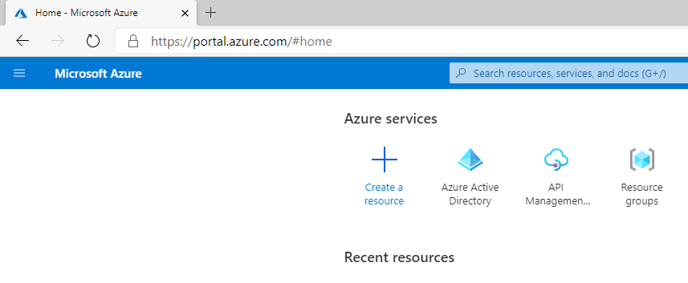
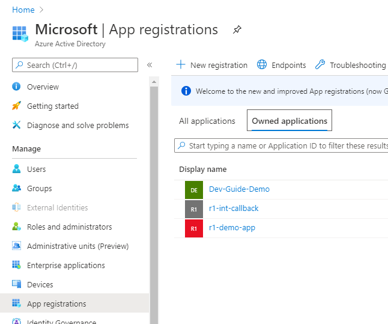
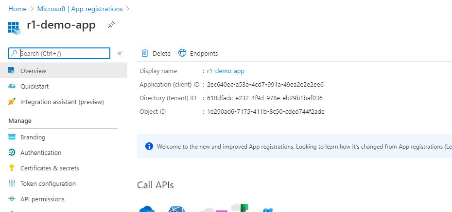
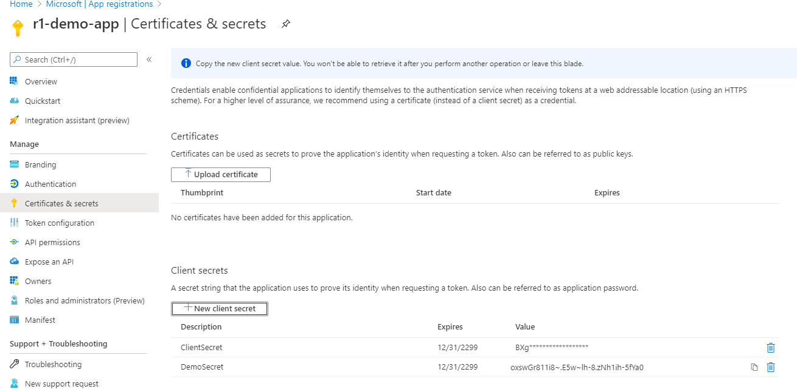
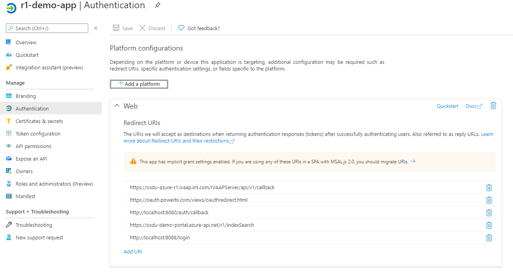
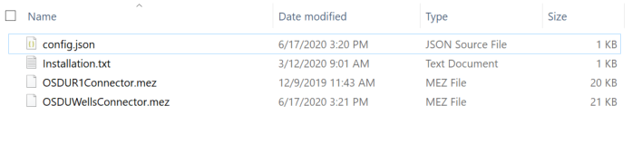

# Prerequisites

To setup the connector you will need to have the connnection parameters of an OSDU instance and have entitlements setup for the particular instance to query

## Connection Parameters

Demo environment parameters will be provided by Microsoft. Current parameters as
of 6/22/2020 for R2 QA environment is provided below. For customer tenant custom
deployments the location to get the parameter is also provided.

**client_id \<Your Client ID Here\>**



Select App Registrations if you have an existing application then select it
otherwise select New Registration.



Client ID can be obtained from the Overview tab under Application (client) ID
value. Copy this for Client_Id parameter.



**client_secret \<Your Client Secret Here\>**

Select Certificates and secrets tab, hit New client secret and copy the Value
for client_secret. Note that once you create and save the client secret, you
will not have access to the secret value. Be sure to copy it as soon as you
create before navigating to a new tab.



**scopes openid profile offline_access \<Your Client ID Here\>/.default**

The last parameter of the scopes parameter contains a GUID, replace it with the
client_id parameter above if you’re accessing a custom application

In the following parameters, you will need the replace the GUID with the tenant
ID for custom deployments.

**tenant_id \<Your Tenant ID Here\>**

**auth_authorize_url** [https://login.microsoftonline.com/\<Your Tenan ID
Here\>/oauth2/v2.0/authorize](https://login.microsoftonline.com/%3cYour%20Tenan%20ID%20Here%3e/oauth2/v2.0/authorize)

**auth_token_url** [https://login.microsoftonline.com/\<Your Tenan ID
Here\>/oauth2/v2.0/token](https://login.microsoftonline.com/%3cYour%20Tenan%20ID%20Here%3e/oauth2/v2.0/token)


**auth_callback_url** <http://localhost:8080/auth/callback>

Callback URL needs to be added to the Authentication tab as a Web Redirect URI



**search_api_url \<OSDU Host Here\>/api/search/v2/query**

**data-partition-id  \<Your Data Partiton ID Here\>**

These parameters need to be provided by the deployment team for deployments in
customer tenants

## Authorization and Entitlements
### Auth Code
To get the auth code first ensure that your application registration has a reply/redirect URL. To do this, naviate to the "Authentication" pane of your app registration in the Azure portal. If there are no redirect URI's specified, add a platform, select "Web", then add `http://localhost:8080`, and click save.

Next, navigate the following URL in a browser, replacing `{Tenant ID}` with your Azure `Directory (tenant) ID` and `{AppReg ID}` with your `Application (client) ID`:

```bash
https://login.microsoftonline.com/{Tenant ID}/oauth2/v2.0/authorize?client_id={AppReg ID}&response_type=code&redirect_uri=http%3a%2f%2flocalhost%3a8080&response_mode=query&scope={AppReg ID}%2f.default&state=12345&sso_reload=true
```

The browser will redirect to `http://localhost:8080/?code={authorization code}&state=...` upon successful authentication. **Note:** The browser may say that the site cannot be reached, but **it should still have the authorization code in the URL bar.**

### Refresh token
Populate the Postman environment and then, run the refresh token queries in the Postman collection
Running the Fetch refresh token query should give a response similar to:

#### Sample Reponse
```bash
{
    "token_type": "Bearer",
    "scope": "<Client ID>/User.Read <Client ID>/.default",
    "expires_in": 4661,
    "ext_expires_in": 4661,
    "access_token": "eyJ0eXAiOiJKV...",
    "refresh_token": "0.ARoAv4j5cv..."
}
```
and login with refresh token query should give a response similar to:

#### Sample Reponse
```bash
{
    "token_type": "Bearer",
    "scope": "<Client ID>/User.Read",
    "expires_in": 4930,
    "ext_expires_in": 4930,
    "access_token": "eyJ0eXAiOiJKV..",
    "refresh_token": "0.ARoAv4j5cv..."
}
```

This will store the acces token need for entitlements into the environment.

### Entitlements
Next run the entitlements queries and check that the desired response is given.

#### Sample Reponse

```bash
    {
        "email": "90e0d063-2f8e-4244-860a-XXXXXXXXXX",
        "role": "MEMBER"
    }
```
These steps will give the required etitlements to the user.

# PowerBI Connectivity

## Building a Connector to OSDU R2 supporting OAuth2 and OpenID

To be able to connect to OSDU R2 we need to support OAuth2 and OpenID protocol
with Code Grant Workflow. This needs development of a very simple Power BI
connector in M Language. Most of the code is boilerplate and the core part of
the code could also be augmented with other M Language constructors to clean up
the results. For illustrative purposes we will provide a very simple connector
which could be used to send a full text query and get the returned results as a
hierarchical JSON object which is re-shaped in Power BI Desktop.

First we’ll need to open Visual Studio 2019 and load M-Language extensions. Select
Extensions and install Power Query SDK as shown below.


Once installed open the M Language Project here.

Solution has 3 main files and set of resources. Config.json stores the
connection parameters, it has been pre-populated with the demo environment
values. For custom tenants, replace the parameters with the customer values as
explained in the first section of this document.

OSDUWellsConnector.pq is the main code with the connector logic.
OSDUWellsConnector.query.pq has the test code which enabled the connector to be
run and tested within Visual Studio, Double click the .sln file to enter the project. Next hit F5 or the green run button, first you
will prompted to authenticate and get token, once the token is acquired hit the
Store Credentials, close the window and re-rerun the query. If this step fails, please check if you have the required entitlements to the app/instance you are working with.


Code for the connector consists of several sections, mostly boilerplate code to
acquire and store tokens via OAuth2 and OpenID code grant workflow.

The main section that call’s OSDU R2 is below, the variables defined here shown
up in the connector surface when getting data in the Power BI Desktop. You can
also put the keyword optional in front of the variables you define. For the
purposes of the demo we are defining a kind attribute and query which form the
body of the search query in Lucene syntax sent to the OSDU R2 search engine.

[DataSource.Kind="OSDUWellsConnector", Publish="OSDUWellsConnector.Publish"]

```bash
shared OSDUWellsConnector.Contents = (kind as text, query as text) =\>

let

body = GetQueryString(kind as text, query as text),

Source = **Json.Document**(**Web.Contents**(osduindexsearchendpoint,[

Headers = [\#"Content-Type"="application/json",
\#"data-partition-id"=data_partition_id],

Content = **Text.ToBinary**(body)

]

))

in

Source;
```

GetQueryString function forms the query from the input parameters. The rest of
code doesn’t need to be changed, it is boilerplate code to get the id_token and
authorization tokens.

Build the application, it generates OSDUWellsConnector.mez located under
\<Project Directory\>/bin/Debug or Release.

Copy the .mez file and the config.json file in the project directory to the
following directory. Create the directory if it doesn’t exist. If Power BI
Desktop is open, close and reopen.

C:\\Users\\\<username\>\\Documents\\Power BI Desktop\\Custom Connectors

NOTE: If you don't see the connector in PowerBI, you might have a redirected Documents folder.
Directory above might not work if your organization has implemented a home folder redirection. 
Check the location of your Documents folder and create a directory here.
For example : C:\\Users\\<username>\\OneDrive\\Documents\\Power BI Desktop\\Custom Connectors



Open Power BI Desktop (not the PowerBI Windows Application). You can download
Power BI Desktop from <https://powerbi.microsoft.com/en-us/desktop/>, login with
your corporate credentials. Dismiss the data window.

From the menu select File -\> Options and setting and select Options


Select Security Options and under Data Extension click the second option,
re-start Power BI Desktop.


Select Get data on the Splash window. Note that if you dismissed this window,
you can access Get data from the top menu.


Select Other and OSDUWellsConnector (Beta). If you don’t see the connector after
copying mez file most probably there’s an issue with the connector code.


Fill in the kind and query fields with the OSDU syntax and hit OK.


On the first run you will be prompted to login with your credentials and get the
token. Make sure that the credentials are either enabled on the demo tenant or
in your own tenant if you’re using a custom deployment. Hit Sign, fill in
account details and hit connect.

You will get a query results window where the data from OSDU R2 is pulled as a
hierarchical json file. For a sample file see the PBIX file here.


  
After you get the records, from the transform tab convert data into a table. You can further expand columns and apply filters by right clicking on a column. After this apply this data from the button at the top left and proceed to the visualisations window. Add any visual you want and select the data fileds you want as part of it.


