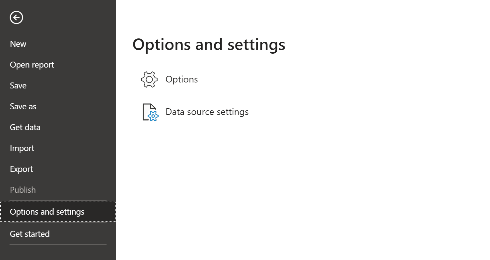
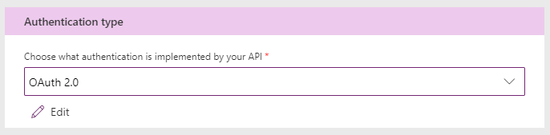
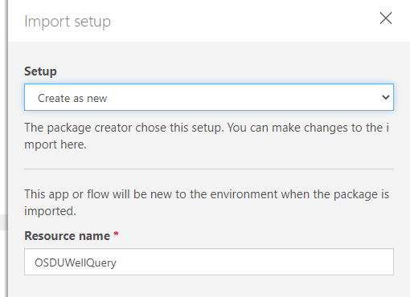
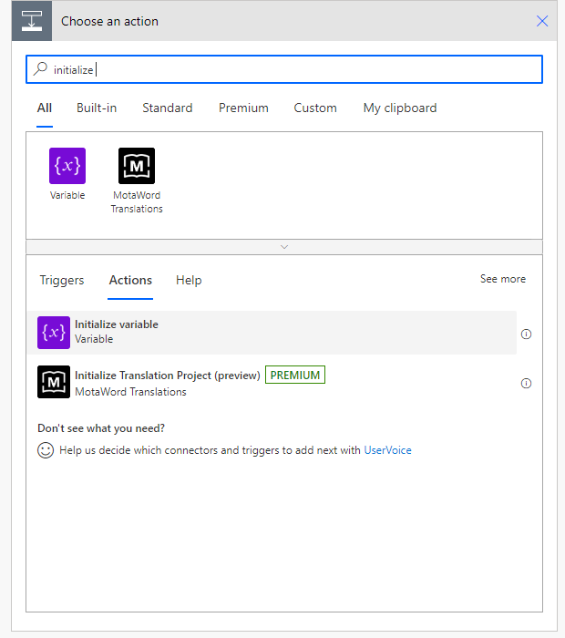

# OSDU Power BI Data Connector

## Overview

This Power BI Data Connector can be used to connect OSDU to Power BI as a data source. There are three ways to use the connector:

1. [Pre-compiled connector](#pre-compiled-connector)
1. [Compile the connector](#compiling-the-connector)
1. [Power Apps and Power Automate](#connecting-power-apps-and-power-automate-to-osdu-r2)

### Prerequisites

There are a few pieces necessary to support OAUth authentication from the connector. These will be used in the config file of the pre-compiled and self-compiled connector.

1. App Registration and Client ID
1. PKCE Capable Redirect URI
1. Tenant ID

### Azure

These steps will walk you through creating an Azure AD Application and configuring it for the Connector.

1. Navigate to the Azure Active Directory page in your Azure Portal
1. Click "+ Add" and select "App Registration"
1. Enter a name
1. Select "Single-page application (SPA)" under "Redirect URI", and enter a redirect URI  (e.g. http://localhost:8080/auth/callback)
    > If you plan to use the connector with an [on-premises data gateway](https://docs.microsoft.com/en-us/data-integration/gateway/service-gateway-onprem) you'll need to use https://oauth.powerbi.com/views/oauthredirect.html for the redirect URI
1. Click "Register"
1. Note the "Application (client) ID" and "Directory (tenant) ID" from the overview page. You will need these for the configuration file.

## Pre-compiled Connector

The pre-compiled connector offers and easy way to connect OSDU to Power BI without the overhead of using Visual Studio.

### Steps

1. Download the [pre-compiled connector](./Power%20BI%20Connector/Compiled%20Code/OSDUWellsConnector.mez)
1. Change the extension type from .mez to .zip
1. Download the sample [config.json](./Power%20BI%20Connector/OSDUWellsConnector/OSDUWellsConnector/config.json) file, populate it with your values, and place it in the .zip
1. Change the extension back to .mez

## Compiling the Connector

To connect to OSDU R2 we need to support OAuth2 and OpenID protocol
with Code Grant Workflow. This needs development of a very simple Power BI
connector in M Language. Most of the code is boilerplate and the core part of
the code could also be augmented with other M Language constructors to clean up
the results. For illustrative purposes we will provide a very simple connector
which could be used to send a full text query and get the returned results as a
hierarchical JSON object which is re-shaped in Power BI Desktop.

Solution has 3 main files and set of resources. Config.json stores the
connection parameters, it has been pre-populated with the demo environment
values. For custom tenants, replace the parameters with the customer values as
explained in the first section of this document.

OSDUWellsConnector.pg is the main code with the connector logic.
OSDUWellsConnector.query.pg has the test code which enabled the connector to be
run and tested within Visual Studio.


Code for the connector consists of several sections, mostly boilerplate code to
acquire and store tokens via OAuth2 and OpenID code grant workflow.

The main section that call’s OSDU R2 is below, the variables defined here shown
up in the connector surface when getting data in the Power BI Desktop. You can
also put the keyword optional in front of the variables you define. For the
purposes of the demo we are defining a kind attribute and query which form the
body of the search query in Lucene syntax sent to the OSDU R2 search engine.

```m
[DataSource.Kind="OSDUWellsConnector", Publish="OSDUWellsConnector.Publish"]
shared OSDUWellsConnector.Contents = (kind as text, query as text, optional limit as number, optional offset as number, optional returnedFields as text) =>
    let
            body = GetQueryString(kind, query, limit, offset, returnedFields),
            Source = Json.Document(Web.Contents(osduSearchEndpointUrl,[
                Headers = [#"Content-Type"="application/json", #"data-partition-id"=dataParitionId],
                Content = Text.ToBinary(body)
             ]  
           ))
    in
        Source;
```

GetQueryString function forms the query from the input parameters. The rest of
code doesn’t need to be changed, it is boilerplate code to get the id_token and
authorization tokens.

### Steps

1. Open Visual Studio 2019
1. Install the Power Query SDK extension
    
1. Open the [OSDUWellsConnector.sln file](./Power%20BI%20Connector/OSDUWellsConnector/OSDUWellsConnector.sln) in Visual Studio 2019
1. Configure the [config.json](./Power%20BI%20Connector/OSDUWellsConnector/OSDUWellsConnector/config.json) file
    * Copy the values from [Prerequisites](#prerequisites) into the config file
    * You'll need the client ID, redirect URI, tenant ID, OSDU host name, and your OSDU data partition ID
1. Build the solution by hitting F5 or the run button
    * A connector file (.mez) will be compiled and placed in <Project Directory\>/bin/Debug or Release

### Testing from Visual Studio

There is a [OSDUWellsConnector.query.pq test file](./Power%20BI%20Connector/OSDUWellsConnector/OSDUWellsConnector/OSDUWellsConnector.query.pq) that can be used to test the connector within Visual Studio. You can enter query parameters in this file.

1. Run the test file by hitting F5 or the green run button
1. Authenticate, get a token, and hit Store Credentials
    > Note: Each time you change the query you'll need to reauthenticate and store the credential
1. Close the test window and re-run the test file
    * If successful, you'll see returned data
    * If it fails, check that you have the required entitlements entitlements to the app/instance you are working with. To get the required entitlements follow the steps from [here](https://osdu.projects.opengroup.org/subcommittees/business-model-outreach/projects/app-dev-training/work-products/supporting-docs/)

## Using the Connector with Power BI

Once you have the connector, you can open the sample report, or build your own.

### Prerequisites

1. Data in OSDU
1. Enable unsigned connectors
    1. Open Power BI Desktop
    1. Navigate to File > Options and Settings > Options > Security
    1. Under "Data Extensions", select "Allow any extension to load without validation or warning" ([Read more about custom connectors](https://docs.microsoft.com/en-us/power-bi/connect-data/desktop-connector-extensibility#custom-connectors))
    1. Click OK
1. Copy the connector to C:\Users\<profile>\Documents\Power BI Desktop\Custom Connectors.
    > Create this folder if it doesn't exist

    > If you don't see the connector in PowerBI, you might have a redirected Documents folder.
        Directory above might not work if your organization has implemented a home folder redirection.
        Check the location of your Documents folder and create a directory here.
        For example : C:\Users\<profile>\OneDrive\Documents\Power BI Desktop\Custom Connectors

## Using the Connector with sample Power BI report

1. Download the [sample Power BI Template Report](./Power%20BI%20Sample%20Dashboard/Wells%20Depth%20Report%20Template%20Using%20Connector.pbit)
1. Open the report in Power BI Desktop

# Using the Connector to build a Power BI report

Open Power BI Desktop (not the PowerBI Windows Application). You can download
Power BI Desktop from <https://powerbi.microsoft.com/en-us/desktop/>, login with
your corporate credentials. Dismiss the data window.

From the menu select File -\> Options and setting and select Options



Select Security Options and under Data Extension click the second option,
re-start Power BI Desktop.


Select Get data on the Splash window. Note that if you dismissed this window,
you can access Get data from the top menu.


Select Other and OSDUWellsConnector (Beta). If you don’t see the connector after
copying mez file most probably there’s an issue with the connector code.


Fill in the kind and query fields with the OSDU syntax and hit OK.


On the first run you will be prompted to login with your credentials and get the
token. Make sure that the credentials are either enabled on the demo tenant or
in your own tenant if you’re using a custom deployment. Hit Sign, fill in
account details and hit connect.

You will get a query results window where the data from OSDU R2 is pulled as a
hierarchical json file. For a sample file see the PBIX file here.


  
After you get the records, from the transform tab convert data into a table. You can further expand columns and apply filters by right clicking on a column. After this apply this data from the button at the top left and proceed to the visualisations window. Add any visual you want and select the data fileds you want as part of it.


# Connecting Power Apps and Power Automate to OSDU R2

Connecting to OSDU R2 thru Power Apps will use Power Automate and connector
framework. It will enable a zero code client to read data from OSDU. In this
example we will first create an Power Automate Custom Connector to implement the
OAuth2 and OpenID code grant workflow to get access token and search for data in
OSDU given a kind and query using Lucene syntax.

Connection Parameters are provided for the demo environment, see the first
section to get parameters for your environment. We will need to add a return url
parameter to the Application in Azure Active Directory hence you will need
someone with administrative privileges to make the necessary changes on the
application definitions.

## Prerequisites
In addition to [general prerequisites](#prerequisites), you will also need a client secret. If you are using Azure, you can obtain one on the __Certificates & Secrets__ page of your Azure AD application.

## Creating the Custom Connector for OSDU R2 to support OAuth2/OpenID

To support the code grant workflow we first need to create a custom connector in
Power Automate. Open up the Power Automate designer by navigating to
<https://make.preview.powerapps.com/> , Open data section and select Custom
Connectors, select Import a Postman Collection. In this demo we are using a
simple Postman Collection with a single query to search for wells in OSDU R2.


The Power Automate Connector Postman collection could be downloaded from here.
Note that the query doesn’t run as you need to provide a bearer token.


Note that the Postman collection should be exported as v1. Select the Postman
Collection and give the connector a name.


You can upload a logo if needed, select Security to define OAuth 2 parameters


Select OAuth2 as the authentication type and provide the parameters provided in
first section of this document.



Hit Create connector, make a note of the Redirect URL generated, you should
provide this to your Azure Active Directory Administrator to add it as a
redirect URL in the Application Settings as outlined in the first section of
this document.


Hit Definition, you should see Validation Succeeded at the bottom of the page.


Make sure to change the operation ID to OSDUR2_FulltextSearch for the Power Apps
demos to import.


Hit test, first create a connection by selecting new +Connection. Hit Create to
select a new instance of the connector. Select your account. (Make sure that you
have access to the demo environment, or your system admin has provided you
access if you are using a custom tenant).


You have created a connector


Go back to Custom Connectors and search for the connector you are working on and
select edit (Pencil Icon) to go back and test the connector.


Select the Test tab, fill in the parameters with values and select Test
Operation. Note that the connector instance you’ve created before shows up in
the connections combo on top of the page.


You will see the successful response on the bottom of the page


## Creating the Power Automate Application

Now that you have created a custom connector, you can create a Power Automate
flow using the designer. Navigate to <https://make.preview.powerapps.com/> ,
select Apps -\> Import Canvas App, it upload and select zip file located here.


Upload process begins.


Select the Action Icon and do the following changes





Hit Import to create the Power Apps and Power Automate Flows in your tenant


Open Flows and select the Query Wells in OSDU R2, Click the edit icon (Pencil)


First box gets the UWI from the Power Apps Application


Second and third boxes set the kind and query text. Note that the UWI value read
from Power Apps is used to generate a query data.UWI: \<UWI Value\>.


Third box is the custom connector we’ve built, the kind and query parameters are
sent as calculated. Header parameters are also provided.


We do parse the Json returned from OSDU R2 search query and the information is
extracted using a second block based on the schema. In the first block we
provide a sample OSDU R2 schema which generates the parsing logic.


Finally the result is returned back to Power App.


## Create the Power App UI

In the Power Apps design page select + Create and select Canvas app from blank
to create a Power App.


Select Phone Format and provide an application name


Add the following controls to the gallery:

-   Text - Text Input

-   Button

-   Gallery – Vertical, select the Title, subtitle, and body template

-   Medi - Image


Select Button control, select Action tab on the ribbon above, click Power
Automate on the dynamic ribbon. Select Query Wells in OSDU R2 in the Data panel.
Add following code to OnSelect on top.

ClearCollect(response, QueryWellsinOSDUR2.Run(TextInput1.Text))

Note: Default name for text input is TextInput1, you might need to change above
if the name is different.


Select the Gallery Control and set the data source as response collection which
you’ve just created with the above code.


Hit run on the Ribbon to test the application, search a UWI, for instance 1016.


Optional:

Select image control and add the following code. Power App doesn’t provide a map
visualization control, in this example we are using an image control and using
Bing Maps static image generator, providing the lat – long we are receiving from
OSDU R2. You can use a similar service that generates images or get a free Bing
Maps key at <https://www.microsoft.com/en-us/maps/create-a-bing-maps-key>.

"https://dev.virtualearth.net/REST/V1/Imagery/Map/Aerial/" &
Gallery1.Selected.Latitude & "%2C" & Gallery1.Selected.Longitude &
"/13?mapSize=300,300&format=png&pushpin="& Gallery1.Selected.Latitude & "," &
Gallery1.Selected.Longitude & ";;"& Gallery1.Selected.UWI & "&key=\<Your Key\>"


Run the application and enter a UWI


You have to Save and Publish your application, select File on the ribbon and
select the option to save your application on the cloud


Select Share


You can share your application with other people in your organization


Install Power Apps on your iOS or Android device and login with your
credentials.


Select All Apps from the Power Apps Drop Down if you don’t see the newly created
application in the list.

Select the Application and test from your phone.


Congratulations, you’ve built your first OSDU R2 mobile application.

# Creating the Power Apps Flow – Step by Step

In the previous section we’ve imported the solution for the Power Apps Flow, in
this section we’ll show the step by instruction to build it from scratch

Open the newly created application and select edit


Select the Button and select the Action ribbon item and Select Power Automate


Select Create a new flow


Select the first template called PowerApps button


Add a New Step


Search for Initialize variable and add to the Canvas, repeat this step to add a
second Initialize variable.



Add the following to the two initialize variable boxes:

-   Name: query

-   Type: String

-   Value: data.UWI:

-   Name: kind

-   Type: String

-   Value: opendes:osdu:well-master:0.2.1

For the “query” box, put the cursor after the data:UWI: and select the Ask in
PowerApps from the Dynamic content


It will create a variable to read the UWI value put in the TextBox in the Power
App. Your flow should like this


Add a new step, Select Custom and add the custom connector you’ve created
previously as mentioned in this document


Drag – Drop the kind and query fields from Dynamic content. Note: When you
select the kind or query field the Dynamic content tab pops out.


Add a new Parse JSON step


For the content, select Dynamic content and pick the Body from the customer
connector


Schema could be generated from sample, you can find a sample file from the OSDU
search query under Power Automate Connector Postman
Collection/Sampleresponse.json. Copy the contents of this file, click Generate
from sample, and paste and click done, the schema for parser is generated
automatically.


Create new Select step


Select the From field, and select results from Parse JSON step from the Dynamic
content selector


Add the following to Map variables


Add a new Http Response step by clicking the Add an action within the Apply to
each block.


Add the following parameter as output.


Click Show advanced options. Schema could be generated from sample, you can find
a sample file from the OSDU search query under Power Automate Connector Postman
Collection/ SampleoutputtoPowerApps.json. Copy the contents of this file, click
Generate from sample, and paste and click done, the schema for parser is
generated automatically.


Save the Power Automate Flow and go back to the Power App and select the newly
created Power Automate Flow (PowerApps button in this case)


Add the following code to the Button OnSelect, this will call the new Power
Automate Flow and search for the specific well with the UWI.

*ClearCollect(response, PowerAppsbutton.Run(TextInput1.Text))*

Hit Run and you should see below screen for a sample search
